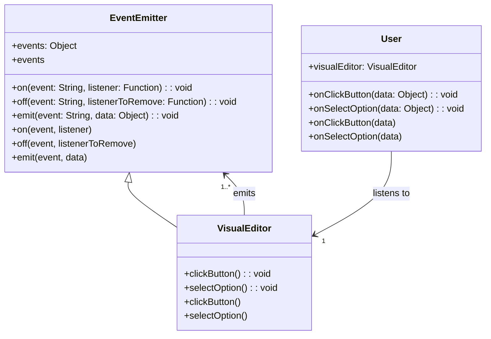

# 2. Events Architecture

Date: 2024-06-13

## Status

Proposed

## Context

Currently, in the Visual Editor, Google Analytics (GA) tracking is implemented by hardcoding event data attributes directly into the component. This approach has limitations:

- It tightly couples the GA tracking logic with the Visual Editor.
- Any changes to GA tracking requirements necessitate changes in the Visual Editor component code.
- The need to pass extra attributes for GA event data complicates the component logic.

To address these issues, we propose implementing an Event Emitter system within the Visual Editor. This will allow us to decouple the GA tracking logic from the Visual Editor component. 
Events will be emitted when users interact with the component (e.g., clicking a button or selecting an option from a dropdown). 
These events can then be listened to by any part of the application to trigger GA data layer pushes or other actions, without requiring changes to the Visual Editor component itself.

## Decision

We will implement an Event Emitter system in the Visual Editor. The component will emit events for user interactions such as button clicks and dropdown selections. 
These events will carry necessary data attributes, and other parts of the application can listen to these events to perform actions like GA tracking.

The following steps outline the implementation:

1. Create an `EventEmitter` class to manage event listeners and emit events.
2. Integrate the `EventEmitter` into the `VisualEditor` component.
3. Emit events from the `VisualEditor` component when user interactions occur (e.g., `clickButton`, `selectOption`).
4. Other parts of the application can register event listeners to handle these events and push data to the GA data layer as needed.

The proposed class diagram is as follows:

## Consequences

### Benefits:
- **Decoupling**: GA tracking logic is decoupled from the Visual Editor component, allowing for easier maintenance and updates.
- **Flexibility**: Any part of the application can listen to events and perform actions, making it easier to extend functionality without modifying the Visual Editor component.
- **Simplicity**: Reduces the complexity of the Visual Editor component by removing hardcoded GA tracking logic.

### Risks:
- **Event Handling Overhead**: Introducing an event system adds complexity in terms of event management and debugging.
- **Performance Impact**: Emitting and listening to events could introduce a slight performance overhead, especially if not managed properly.
- **Error Handling**: Ensuring that event listeners handle errors gracefully to avoid breaking the application flow.

Mitigation strategies will include thorough testing of the event system, performance monitoring, and implementing robust error handling in event listeners.
