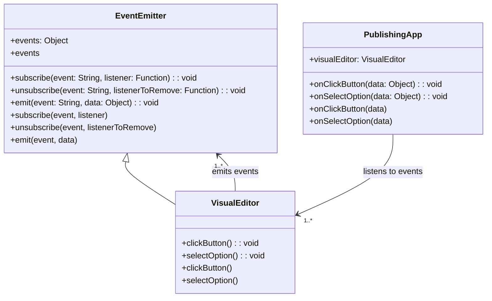

# 2. Events Architecture

Date: 2024-06-13

## Status

Proposed

## Context

Currently, in the Visual Editor, Google Analytics (GA) tracking is implemented by hardcoding event data attributes directly into the component. This approach has limitations:

- It tightly couples the GA tracking logic with the Visual Editor component.
- Any changes to GA tracking requirements necessitate changes in the Visual Editor component code.
- The need to pass extra attributes for GA event data complicates the component logic.

It is required for us to add GA4 tracking attributes to button clicks and select element changes on the toolbar. 
Some of the data exists within publishing apps (e.g., section page heading) and some of the data exists within the Visual Editor (e.g., button text, selected text). 
GOVUK Publishing Components have implemented functionality to track all button clicks on elements with data attributes attached, but there is no existing solution for tracking select element changes.

To address these issues, we propose implementing an Event Emitter system within the Visual Editor. 
This will allow us to decouple the GA tracking logic from the Visual Editor component. 
Events will be emitted when users interact with the component (e.g., clicking a button or selecting an option from a dropdown). 
These events can then be listened to by any part of the application to trigger GA data layer pushes or other actions, without requiring changes to the Visual Editor component itself.

### Alternative Options Considered

1. **Enhancing GOVUK Publishing Components**: 
   - We considered asking the GOVUK Publishing Components team to write new code to track select changes. This would ensure a consistent approach to tracking across all elements. 
   - **Why we opted against this**: This approach would require coordination with an external team, potentially leading to delays and dependencies on their development schedule. 
     Additionally, it would require changes to be implemented and deployed across all publishing components, which could introduce complexities and longer timelines.

2. **Hardcoding GA4 Tracking Logic within Visual Editor**:
   - Another option was to directly embed the GA4 tracking logic within the Visual Editor for each interactive element.
   - **Why we opted against this**: Hardcoding tracking logic within the Visual Editor would tightly couple the analytics tracking with the component, making it difficult to maintain and update. 
     This approach would also violate the separation of concerns principle and increase the complexity of the Visual Editor codebase.

3. **Implementing an Event Emitter System**:
   - The chosen approach is to implement an Event Emitter system within the Visual Editor. This allows the component to emit events for user interactions such as button clicks and select changes. 
     These events can be listened to by other parts of the application to perform actions like GA4 tracking.
   - **Why we chose this option**: This approach decouples the GA4 tracking logic from the Visual Editor, making it easier to maintain and update. 
     It also provides flexibility to handle different types of events without modifying the core Visual Editor component. 
     This method adheres to the separation of concerns principle and simplifies the component logic.

## Decision

We will implement an Event Emitter system in the Visual Editor. The component will emit events for user interactions such as button clicks and dropdown selections. 
These events will carry necessary data attributes, and other parts of the application can listen to these events to perform actions like GA tracking.

The following steps outline the implementation:

1. Create an `EventEmitter` class to manage event listeners and emit events.
2. Integrate the `EventEmitter` into the `VisualEditor` component.
3. Emit events from the `VisualEditor` component when user interactions occur (e.g., `clickButton`, `selectOption`).
4. Other parts of the application can register event listeners to handle these events and push data to the GA data layer as needed.

The proposed class diagram is as follows:

## Consequences

### Benefits:
- **Decoupling**: GA tracking logic is decoupled from the Visual Editor component, allowing for easier maintenance and updates.
- **Flexibility**: Any part of the application can listen to events and perform actions, making it easier to extend functionality without modifying the Visual Editor component.
- **Simplicity**: Reduces the complexity of the Visual Editor component by removing hardcoded GA tracking logic.

### Risks:
- **Event Handling Overhead**: Introducing an event system adds complexity in terms of event management and debugging.
- **Performance Impact**: Emitting and listening to events could introduce a slight performance overhead, especially if not managed properly.
- **Error Handling**: Ensuring that event listeners handle errors gracefully to avoid breaking the application flow.

Mitigation strategies will include thorough testing of the event system, performance monitoring, and implementing robust error handling in event listeners.
